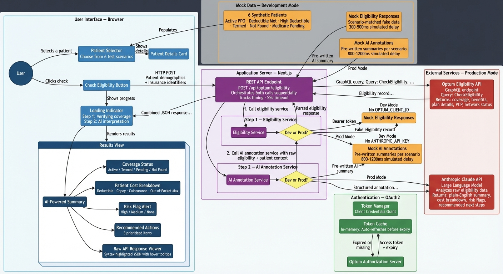

# Optum API Eligibility Starter

A working Next.js starter that demonstrates how to integrate the [Optum Pre-Service Eligibility API](https://developer.optum.com) with Claude AI to translate raw insurance eligibility responses into plain-English summaries for healthcare staff.

This project is a practical reference implementation. Clone it, add your API credentials, and you have a running eligibility verification interface that queries the Optum GraphQL eligibility API.

## What This Demonstrates

- **Optum API integration** — OAuth 2.0 client credentials authentication, GraphQL eligibility query construction, and response parsing
- **Claude AI annotation** — Passing raw GraphQL eligibility response data to Claude and receiving structured plain-English output
- **Six eligibility scenarios** — Active coverage, deductible met, high deductible/HSA, terminated coverage, member not found, and pending enrollment
- **Production-ready patterns** — Token caching, graceful fallback when Claude is unavailable, typed state machine, server-side credential handling
- **Developer experience** — Full mock mode for local development without API keys

## Tech Stack

- [Next.js](https://nextjs.org) 16 (App Router)
- [TypeScript](https://www.typescriptlang.org) 5 (strict mode)
- [Tailwind CSS](https://tailwindcss.com) v4
- [shadcn/ui](https://ui.shadcn.com) components
- [Framer Motion](https://www.framer.com/motion) for loading animations
- [Bun](https://bun.sh) package manager

## Prerequisites

You need two sets of credentials:

**1. Optum Developer Account (sandbox)**

Register at [marketplace.optum.com](https://marketplace.optum.com/apiservices/api-sandbox-access) and request sandbox access to the Real Pre-Service Eligibility API. You will receive a client ID and client secret.

**2. Anthropic API Key**

Create an account at [console.anthropic.com](https://console.anthropic.com) and generate an API key. The app uses `claude-sonnet-4-6` by default.

## Quick Start

```bash
# Clone the repository
git clone https://github.com/paullopez-ai/optum-real-eligibility-starter.git
cd optum-real-eligibility-starter

# Install dependencies
bun install

# Copy the environment template
cp .env.local.example .env.local
```

Open `.env.local` and fill in your credentials:

```bash
# Optum sandbox credentials
OPTUM_CLIENT_ID=your_sandbox_client_id_here
OPTUM_CLIENT_SECRET=your_sandbox_client_secret_here
OPTUM_AUTH_URL=https://idx.linkhealth.com/auth/realms/developer-platform/protocol/openid-connect/token
OPTUM_ELIGIBILITY_URL=https://sandbox-apigw.optum.com/oihub/eligibility/v1/pre-service/member
OPTUM_PROVIDER_TAX_ID=448835440

# Anthropic
ANTHROPIC_API_KEY=your_anthropic_api_key_here

# Set to 'sandbox' or 'production' when using real credentials
NEXT_PUBLIC_APP_ENV=sandbox
```

Then start the development server:

```bash
bun dev
```

Open [http://localhost:3000](http://localhost:3000).

## Running Without API Keys (Mock Mode)

If `NEXT_PUBLIC_APP_ENV=development` and `ANTHROPIC_API_KEY` is not set, the app runs entirely on mock data. You will see realistic eligibility responses and Claude annotations without making any real API calls. This is the default behavior when you first clone the repository.

To enable mock mode explicitly:

```bash
NEXT_PUBLIC_APP_ENV=development
# Leave OPTUM_CLIENT_ID, OPTUM_CLIENT_SECRET, and ANTHROPIC_API_KEY unset or empty
```

## Project Structure

```
app/
  api/optum/eligibility/route.ts  — API route: Optum GraphQL call + Claude annotation
  page.tsx                        — Single-page application with useReducer state
components/
  claude-annotation-panel.tsx     — Left panel: Claude output
  raw-response-panel.tsx          — Right panel: raw GraphQL JSON with field tooltips
  result-panel.tsx                — Split layout parent (60/40)
  coverage-summary.tsx            — Coverage status hero
  responsibility-breakdown.tsx    — Deductible/copay/coinsurance cards
  action-items.tsx                — Prioritized action checklist
  risk-flag.tsx                   — Amber warning for HIGH/MEDIUM risk scenarios
  loading-sequence.tsx            — Two-step animated loading indicator
  [other components]
lib/
  optum-auth.ts                   — OAuth 2.0 token management with caching
  optum-eligibility.ts            — GraphQL query builder, API wrapper, mock responses
  claude-annotator.ts             — Claude API integration and mock annotations
  patients.ts                     — Six synthetic patient test personas
types/
  optum.types.ts                  — GraphQL eligibility input and response interfaces
  claude.types.ts                 — Claude input and output interfaces
  patient.types.ts                — Patient, scenario, and app state types
```

## The Six Scenarios

The app ships with six synthetic patient personas, each covering a distinct eligibility scenario:

| Patient | Scenario | What It Tests |
|---------|----------|---------------|
| Maria Gonzalez | Active Coverage | Standard active plan with remaining deductible |
| James Washington | Deductible Met | Annual deductible fully satisfied, coinsurance applies |
| Aisha Rahman | High Deductible | HDHP with significant patient cost exposure |
| Robert Chen | Coverage Terminated | COBRA expired; plan is inactive |
| Destiny Williams | Member Not Found | Member ID mismatch; lookup returns no record |
| Thomas O'Brien | Pending Enrollment | Future-dated enrollment; not yet effective |

These patients use Optum's sandbox payer ID (`87726`) and are pre-configured with the sandbox field values required to trigger each scenario's response.

## Architecture Overview



The diagram above shows the full request flow from the browser through the application server to external services, including where mock data is used in development mode.

**Request flow:**

```
Browser → POST /api/optum/eligibility
  → 1. Fetch OAuth token from OPTUM_AUTH_URL (cached with 60-second expiry buffer)
  → 2. Send GraphQL query to Optum Eligibility API
  → 3. Call Claude API with raw eligibility response
  → 4. Return { rawResponse, annotation, durationMs }
Browser renders split panel: Claude output (left) + raw JSON (right)
```

Each service (eligibility and AI annotation) independently checks whether to use mock data or call the real API, based on which environment variables and API keys are present. See [Sandbox vs. Production vs. Mock Mode](#sandbox-vs-production-vs-mock-mode) for details.

The Claude call is optional. If it fails or times out, the app displays the raw eligibility response with an "annotation unavailable" notice. The entire route handler has a 55-second abort timeout.

## Extending This Starter

**Add more payers:** Update the `payerId` in a patient object with a different payer ID from the Optum sandbox documentation.

**Add service type selection:** The `serviceTypeCode` field on each patient maps to service level codes used in the GraphQL query (e.g., `30` for general health benefit, `33` for chiropractic, `47` for vision). Wire this to a UI selector to enable benefit-type-specific queries.

**Swap Claude for another model:** The annotator in `lib/claude-annotator.ts` is a standard fetch call to the Anthropic API. Replace it with any model that returns structured JSON.

**Add your own patients:** The patient list in `lib/patients.ts` is a static TypeScript array. Add objects matching the `SyntheticPatient` interface, including the Optum sandbox field values for your scenario.

## Environment Variables Reference

| Variable | Required | Description |
|----------|----------|-------------|
| `OPTUM_CLIENT_ID` | For real API calls | OAuth client ID from Optum Marketplace |
| `OPTUM_CLIENT_SECRET` | For real API calls | OAuth client secret from Optum Marketplace |
| `OPTUM_AUTH_URL` | For real API calls | `https://idx.linkhealth.com/auth/realms/developer-platform/protocol/openid-connect/token` |
| `OPTUM_ELIGIBILITY_URL` | For real API calls | `https://sandbox-apigw.optum.com/oihub/eligibility/v1/pre-service/member` |
| `OPTUM_PROVIDER_TAX_ID` | For real API calls | Provider Tax ID (sandbox default: `448835440`) |
| `ANTHROPIC_API_KEY` | For Claude annotations | API key from console.anthropic.com |
| `NEXT_PUBLIC_APP_ENV` | Optional | Set to `sandbox` or `production` to disable mock mode |

## Sandbox vs. Production vs. Mock Mode

This starter operates in three distinct modes. Understanding the differences is important before evaluating what you see in the UI.

### Mock Mode (no API keys required)

When `NEXT_PUBLIC_APP_ENV=development` and no API keys are present, the app returns **hand-crafted mock data** that demonstrates what a fully working integration looks like. This is the default when you first clone the repo.

Mock mode is useful for:
- Exploring the UI and all six eligibility scenarios without any credentials
- Frontend development and component work
- Demonstrating the concept to stakeholders

The mock responses are realistic but synthetic — they were written to match the GraphQL response shape and include rich plan-level detail (deductibles, copays, coinsurance, service-level benefits) that showcases the full capability of the Optum API.

### Sandbox Mode (Optum sandbox credentials)

With sandbox credentials from [marketplace.optum.com](https://marketplace.optum.com/apiservices/api-sandbox-access), the app makes real HTTP calls to Optum's sandbox environment. However, there are important limitations:

**What the sandbox does well:**
- Validates your OAuth 2.0 authentication flow end-to-end
- Confirms your GraphQL query structure and variable formatting are correct
- Returns a real GraphQL response envelope so you can verify parsing logic
- Proves network connectivity, header requirements, and error handling

**What the sandbox does not do:**
- The sandbox does not return the same rich, scenario-specific eligibility data shown in mock mode. Sandbox responses are generic and may contain placeholder or minimal data regardless of which synthetic patient you select.
- The six patient scenarios (active, deductible met, high deductible, terminated, not found, pending) are **mock mode constructs**. The sandbox does not have pre-seeded test members that map to these scenarios — it returns whatever its internal test data provides for any valid request.
- Service-level details (per-service copays, coinsurance breakdowns, benefit messages) may be sparse or absent in sandbox responses compared to what a production account returns for real members.
- The `environment: sandbox` header is **required** for the sandbox to return any data at all. Without it, requests may fail silently or return empty results.

**Sandbox gotchas discovered during development:**
- The OAuth token endpoint is **not** at `sandbox-apigw.optum.com/oauth/token` (that returns a 400). The working auth URL is `idx.linkhealth.com/auth/realms/developer-platform/protocol/openid-connect/token` — a completely different host. This is not obvious from the developer portal.
- `providerFirstName` and `providerLastName` are required non-null fields (`String!`) in the GraphQL schema. Omitting them produces a 400 validation error with the message: *"Field 'providerLastName' has coerced Null value for NonNull type 'String!'"*. Placeholder values work fine.
- Date of birth must be `YYYY-MM-DD` format (not `YYYYMMDD`). The app handles this conversion automatically.
- The `providerTaxId` header is separate from the GraphQL variables — it goes in the HTTP headers, not the query body.
- The `x-optum-consumer-correlation-id` header is required for request tracing.

### Production Mode (live Optum credentials)

A production Optum account with real provider credentials is required to see the full eligibility responses that the mock data demonstrates. With production access:
- Real member lookups return complete plan-level and service-level benefit details
- Terminated, pending, and not-found scenarios occur naturally based on actual member status
- Copay amounts, deductible balances, coinsurance rates, and OOP maximums reflect real plan data

To run in production mode, update your `.env.local` with production credentials and set `NEXT_PUBLIC_APP_ENV=production`. The `OPTUM_ELIGIBILITY_URL` will change to the production GraphQL endpoint (provided by Optum when your production access is approved).

### How the mode switching works

The dev/prod decision does **not** happen at the API route level. The route at `/api/optum/eligibility` always executes. Each downstream service checks independently:

| Service | Dev mode condition | Dev behavior | Prod behavior |
|---------|-------------------|--------------|---------------|
| Eligibility | `APP_ENV=development` AND no `OPTUM_CLIENT_ID` | Returns scenario-matched mock data (300-500ms delay) | Authenticates via OAuth, sends GraphQL query to Optum |
| AI Annotation | `APP_ENV=development` AND no `ANTHROPIC_API_KEY` | Returns pre-written annotation (800-1200ms delay) | Sends raw eligibility + patient context to Claude API |

This means you can run in **hybrid mode** — for example, real Optum data with mock AI annotations (if you have Optum keys but no Anthropic key), or mock eligibility data with real Claude analysis (if you have an Anthropic key but no Optum keys). Each service falls back to mocks independently based on which keys are present.

## License

MIT

---

Built by [Paul Lopez](https://paullopez.ai) as a reference implementation for healthcare developers working with the Optum Pre-Service Eligibility API.
